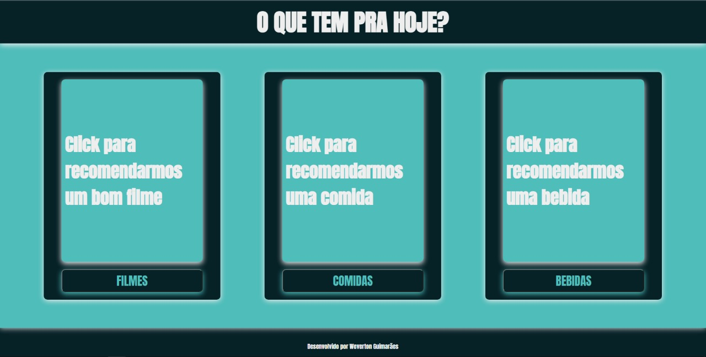

# OQueTemPraHoje
Esse projeto partiu de uma idea de gerar randomicamente algo para assistir e algo para comer para usar naqueles dias que não se tem nada para fazer.
Partindo dessa ideia fiz 3 arrays com Filmes,comidas e bebidas respectivamente, e criei uma função que gerar numeros randomicos.
Criei também funções para que eu traga o resultado na tela mudando o valor inicial do html pelo que foi gerado pelo Javascrip.

sendo assim, quando clico no botão o valor é gerado randomicamente e o numero gerado é a posição do array que será mostrado na tela para o usuário.

para acessar e fazer o teste basta seguir o link <a>https://oque-tem-pra-hoje.vercel.app/</a>

